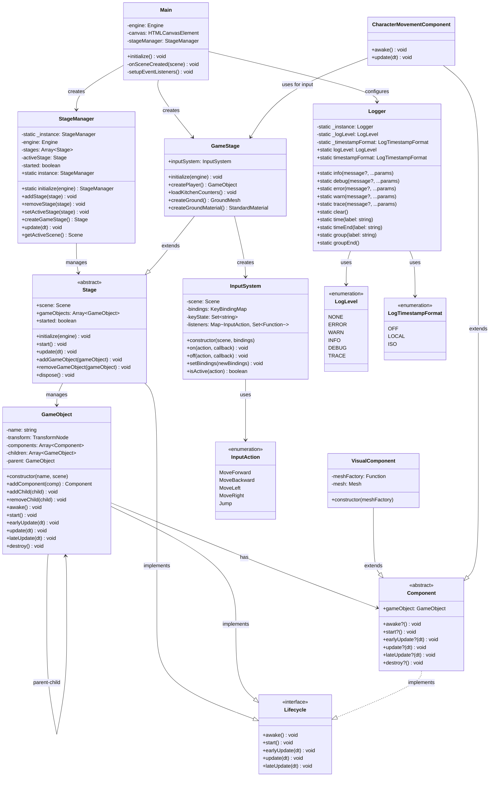
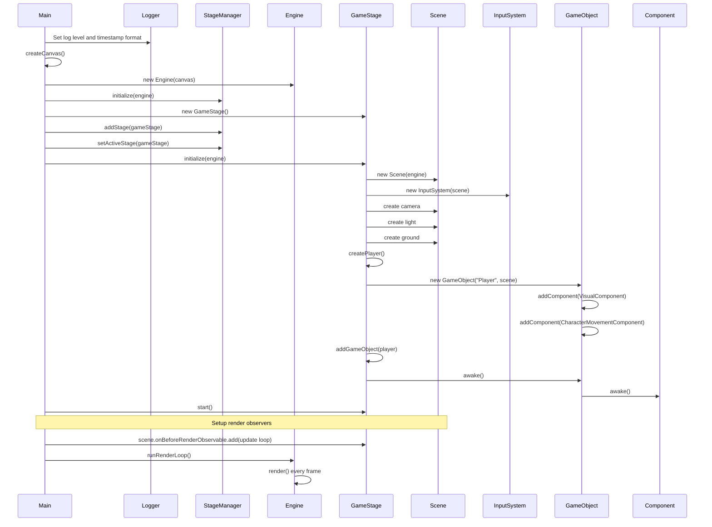
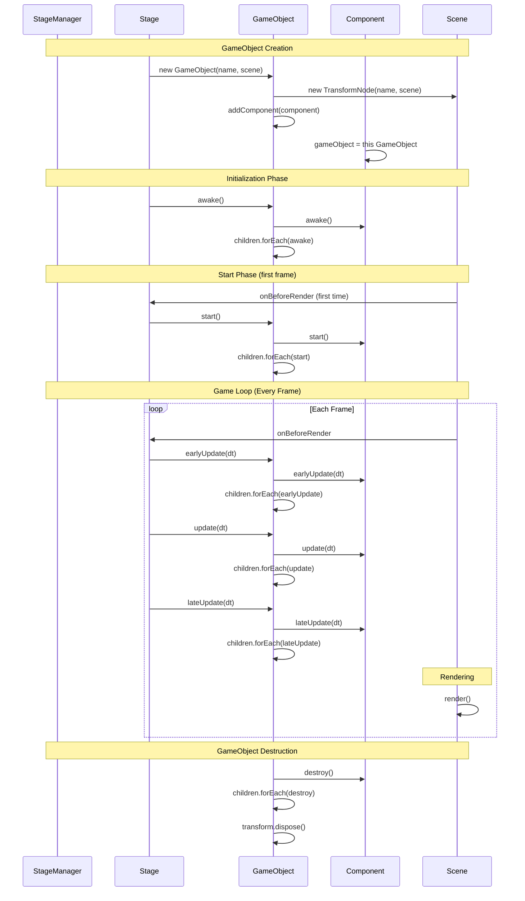
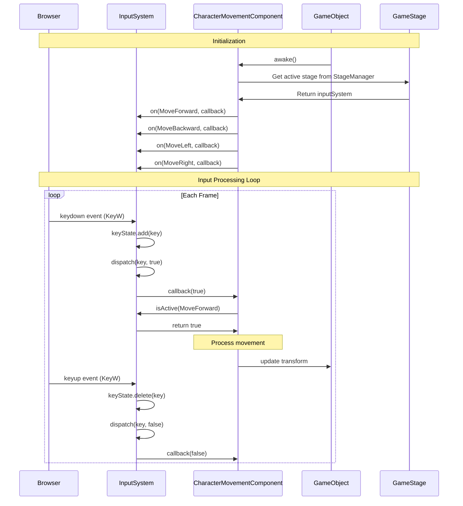

# Kitchen Chaos - Documentation

- [Kitchen Chaos - Documentation](#kitchen-chaos---documentation)
  - [Overview](#overview)
  - [Architecture](#architecture)
  - [Class Documentation](#class-documentation)
    - [Core Framework Classes](#core-framework-classes)
      - [`Main`](#main)
      - [`Logger`](#logger)
      - [`StageManager`](#stagemanager)
      - [`Stage`](#stage)
      - [`GameStage`](#gamestage)
      - [`GameObject`](#gameobject)
    - [Component System](#component-system)
      - [`Component`](#component)
      - [`VisualComponent`](#visualcomponent)
      - [`CharacterMovementComponent`](#charactermovementcomponent)
      - [`InputAction`](#inputaction)
    - [Input System](#input-system)
      - [`InputSystem`](#inputsystem)
    - [Interfaces](#interfaces)
      - [`Lifecycle`](#lifecycle)
  - [Mermaid UML Diagrams](#mermaid-uml-diagrams)
    - [Class Diagram](#class-diagram)
    - [Sequence Diagram - Application Startup](#sequence-diagram---application-startup)
    - [Sequence Diagram - GameObject Lifecycle](#sequence-diagram---gameobject-lifecycle)
    - [Sequence Diagram - Input Processing](#sequence-diagram---input-processing)
  - [Project Structure](#project-structure)
  - [Key Design Patterns](#key-design-patterns)
    - [Singleton Pattern](#singleton-pattern)
    - [GameObject-Component System](#gameobject-component-system)
    - [Observer Pattern](#observer-pattern)
    - [Hierarchical Transform Pattern](#hierarchical-transform-pattern)
  - [Dependencies](#dependencies)
  - [Development Notes](#development-notes)
  - [Getting Started](#getting-started)
  - [Future Enhancements](#future-enhancements)

## Overview

Kitchen Chaos is a BabylonJS-based 3D game built with TypeScript. This project is a port of the Unity tutorial "Kitchen Chaos" by Code Monkey, adapted to use BabylonJS instead of Unity. The original Unity course can be found at: [https://unitycodemonkey.com/kitchenchaoscourse.php](https://unitycodemonkey.com/kitchenchaoscourse.php)

The project follows a modular architecture with a custom framework that provides GameObject-component system capabilities, scene management, and utilities for game development.

## Architecture

The project is structured around several key components:

- **Framework Layer**: Core systems for GameObject management, scene management, logging, and utilities
- **Component System**: Modular functionality through components attached to GameObjects
- **Input System**: Action-based input handling with configurable key bindings
- **Main Entry Point**: Application initialization and lifecycle management

## Class Documentation

### Core Framework Classes

#### `Main`

**Location**: `src/main.ts`

The main application class that initializes and starts the game.

**Methods**:

- `initialize()`: Initializes logging, creates canvas and engine, creates and configures GameStage
- `private onSceneCreated(scene)`: Sets up event listeners and starts render loop
- `private setupEventListeners()`: Adds keyboard shortcuts for fullscreen and debug layer

**Key Features**:

- Configures logging levels and timestamp formats
- Handles keyboard shortcuts (Shift+Ctrl+Alt+F for fullscreen, Shift+Ctrl+Alt+I for inspector)
- Creates HTML canvas and BabylonJS engine
- Creates GameStage instance and initializes it
- Passes GameStage to StageManager for management
- Sets up canvas focus for keyboard input

---

#### `Logger`

**Location**: `src/framework/Logger.ts`

A static utility class for logging with configurable levels and timestamp formats.

**Enums**:

- `LogLevel`: NONE=0, ERROR=1, WARN=2, INFO=3, DEBUG=4, TRACE=5
- `LogTimestampFormat`: OFF=0, LOCAL=1, ISO=3

**Static Methods**:

- `info(message?, ...optionalParams)`: Logs info messages
- `debug(message?, ...optionalParams)`: Logs debug messages
- `error(message?, ...optionalParams)`: Logs error messages
- `warn(message?, ...optionalParams)`: Logs warning messages
- `trace(message?, ...optionalParams)`: Logs trace messages
- `clear()`: Clears the console
- `time(label)`: Starts a timer
- `timeEnd(label)`: Ends a timer
- `group(label)`: Starts a console group
- `groupEnd()`: Ends a console group
- `groupCollapsed(label)`: Starts a collapsed console group
- `dir(message?, ...optionalParams)`: Displays object in directory format
- `dirxml(value)`: Displays XML representation
- `table(tabularData, properties?)`: Displays data in table format

**Static Properties**:

- `logLevel`: Gets/sets the current log level
- `timestampFormat`: Gets/sets the timestamp format

---

#### `StageManager`

**Location**: `src/framework/StageManager.ts`

A singleton class that manages multiple stages, coordinates the main game loop, and handles stage transitions.

**Static Properties**:

- `instance`: Gets the singleton instance

**Instance Properties**:

- `engine`: The BabylonJS engine
- `stages`: Array of all active stages
- `activeStage`: The currently active stage
- `started`: Flag indicating if the game has started

**Static Methods**:

- `get instance()`: Gets the singleton instance
- `initialize(engine)`: Initializes the singleton StageManager

**Instance Methods**:

- `addStage(stage)`: Adds a stage to the manager
- `removeStage(stage)`: Removes a stage and disposes it
- `setActiveStage(stage)`: Sets the active stage
- `update(dt)`: Updates the active stage
- `getActiveScene()`: Gets the current active scene

**Key Features**:

- Manages multiple stages with lifecycle coordination
- Coordinates the main game loop for the active stage
- Handles stage transitions and resource management
- Provides access to the current active scene
- Pure stage management without creation responsibilities

---

#### `Stage`

**Location**: `src/framework/Stage.ts`

Abstract base class for all game stages. A stage represents a self-contained scene with its own GameObjects and lifecycle.

**Properties**:

- `scene`: The BabylonJS scene for this stage
- `gameObjects`: Array of all active GameObjects in this stage
- `started`: Flag indicating if the stage has started

**Methods**:

- `initialize(engine)`: Abstract method to initialize the stage
- `start()`: Called when the stage should start its game loop
- `update(dt)`: Updates all GameObjects in the stage
- `addGameObject(gameObject)`: Adds a GameObject to this stage
- `removeGameObject(gameObject)`: Removes a GameObject from this stage
- `dispose()`: Cleans up the stage and disposes of all resources

**Key Features**:

- Scene management and lifecycle
- GameObject coordination within the stage
- Stage-specific initialization and cleanup

---

#### `GameStage`

**Location**: `src/framework/GameStage.ts`

Concrete implementation of Stage for the main game scene. Contains the kitchen chaos game environment with player, counters, and game objects.

**Properties**:

- `inputSystem`: Global input system for handling user input

**Methods**:

- `initialize(engine)`: Initializes the game stage with the kitchen chaos scene
- `createPlayer()`: Creates and configures the player GameObject
- `loadKitchenCounters()`: Loads all kitchen counter models
- `createGround()`: Creates the ground mesh with texture
- `createGroundMaterial()`: Creates ground material with texture

**Key Features**:

- Sets up camera, lighting, ground, player, and kitchen counters
- Manages the input system for the game stage
- Loads 3D models for kitchen environment
- Configures player visual components and movement

---

#### `GameObject`

**Location**: `src/framework/GameObject.ts`

A class representing game objects in the scene hierarchy with component-based architecture.

**Properties**:

- `name`: The name/identifier for this GameObject
- `transform`: Babylon.js TransformNode for position, rotation, and scale
- `components`: Array of components attached to this GameObject
- `children`: Array of child GameObjects in the hierarchy
- `parent`: Reference to the parent GameObject, if this is a child

**Methods**:

- `constructor(name, scene)`: Creates a new GameObject with a TransformNode
- `addComponent(comp)`: Adds a component to this GameObject
- `addChild(child)`: Adds a child GameObject to the hierarchy
- `removeChild(child)`: Removes a child GameObject from the hierarchy
- `awake()`: Dispatches awake call to all components and children
- `start()`: Dispatches start call to all components and children
- `earlyUpdate(dt)`: Dispatches earlyUpdate to all components and children
- `update(dt)`: Dispatches update to all components and children
- `lateUpdate(dt)`: Dispatches lateUpdate to all components and children
- `destroy()`: Dispatches destroy call to all components and children

**Key Features**:

- Component-based architecture for modular functionality
- Hierarchical parent-child relationships with transform inheritance
- Automatic lifecycle propagation to components and children
- Scene integration through Babylon.js TransformNode

---

### Component System

#### `Component`

**Location**: `src/framework/components/Component.ts`

Abstract base class for all components that implements the Lifecycle interface.

**Properties**:

- `gameObject`: The GameObject this component is attached to

**Methods**:

- `awake?()`: Optional initialization method
- `start?()`: Optional start method
- `earlyUpdate?(dt)`: Optional early update method
- `update?(dt)`: Optional update method
- `lateUpdate?(dt)`: Optional late update method
- `destroy?()`: Optional cleanup method

**Key Constraints**:

- All components MUST be attached to a GameObject to function
- Components CANNOT have children components (use GameObject composition instead)
- Components implement the Lifecycle interface for game loop participation

---

#### `VisualComponent`

**Location**: `src/framework/components/VisualComponent.ts`

Component for handling visual representation of GameObjects through Babylon.js meshes.

**Methods**:

- `constructor(meshFactory)`: Creates a visual component with a mesh factory function

**Key Features**:

- Creates and manages Babylon.js meshes
- Uses factory pattern for flexible mesh creation
- Automatically handles mesh disposal

---

#### `CharacterMovementComponent`

**Location**: `src/framework/components/CharacterMovement.ts`

Component for character movement control using the input system.

**Methods**:

- `awake()`: Sets up input system listeners by accessing the active GameStage
- `update(dt)`: Processes input and updates GameObject position

**Key Features**:

- Responds to MoveForward, MoveBackward, MoveLeft, MoveRight actions
- Gets InputSystem from the active GameStage instance
- Updates GameObject transform based on input
- Includes error handling for missing active stage

---

#### `InputAction`

**Location**: `src/framework/input/InputAction.ts`

Enum defining available input actions in the game.

**Values**:

- MoveForward
- MoveBackward
- MoveLeft
- MoveRight
- Jump

**Type Definition**:

- `KeyBindingMap`: Type mapping InputActions to keyboard key codes

---

### Input System

#### `InputSystem`

**Location**: `src/framework/input/InputSystem.ts`

Class for action-based input handling with configurable key bindings.

**Properties**:

- `scene`: The Babylon.js scene for input events
- `bindings`: Map of InputActions to key codes
- `keyState`: Set of currently pressed keys
- `listeners`: Map of actions to callback functions

**Methods**:

- `constructor(scene, bindings)`: Initializes input system with optional custom bindings
- `on(action, callback)`: Registers a callback for an input action
- `off(action, callback)`: Removes a callback for an input action
- `setBindings(newBindings)`: Updates key bindings
- `isActive(action)`: Returns true if the action is currently active

**Default Bindings**:

- MoveForward: "KeyW"
- MoveBackward: "KeyS"
- MoveLeft: "KeyA"
- MoveRight: "KeyD"
- Jump: "Space"

**Key Features**:

- Action-based input abstraction
- Configurable key bindings
- Event-driven and polling-based input access
- Multiple listeners per action

---

### Interfaces

#### `Lifecycle`

**Location**: `src/framework/interfaces/Lifecycle.ts`

Interface defining the standard lifecycle methods for game objects and components.

**Methods**:

- `awake()`: Initialization when object becomes active
- `start()`: Called once before first update
- `earlyUpdate(dt)`: Called every frame before main update
- `update(dt)`: Called every frame for main game logic
- `lateUpdate(dt)`: Called every frame after all updates

**Note**: All methods are optional and can be implemented as needed.

---

## Mermaid UML Diagrams

### Class Diagram



### Sequence Diagram - Application Startup



### Sequence Diagram - GameObject Lifecycle



### Sequence Diagram - Input Processing



## Project Structure

```txt
src/
├── main.ts                      # Application entry point
├── vite-env.d.ts                # Vite environment types
└── framework/                   # Core framework
    ├── Stage.ts                  # Abstract base stage class
    ├── StageManager.ts           # Singleton stage manager
    ├── GameStage.ts             # Concrete game stage implementation
    ├── GameObject.ts            # Base GameObject class
    ├── components/              # Component system
    │   ├── Component.ts         # Base component class
    │   ├── VisualComponent.ts   # Visual/mesh component
    │   └── CharacterMovement.ts # Movement component
    ├── input/                   # Input system
    │   ├── InputAction.ts       # Input action enum
    │   └── InputSystem.ts       # Input handling system
    ├── interfaces/              # Framework interfaces
    │   └── Lifecycle.ts         # Lifecycle interface
    └── logger/                  # Logging utility
        └── Logger.ts            # Logging system
```

## Key Design Patterns

### Singleton Pattern

- `StageManager` and `Logger` use singleton pattern for global access
- Ensures single instance and provides global point of access

### GameObject-Component System

- `GameObject` class provides component management and hierarchical relationships
- `Component` base class for modular functionality
- Components are attached to GameObjects for specific behaviors
- Parent-child relationships with transform inheritance

### Observer Pattern

- BabylonJS scene observers used for GameObject lifecycle management
- Input system uses event listeners for keyboard handling
- Components can register callbacks with input system

### Hierarchical Transform Pattern

- GameObjects have parent-child relationships
- Transform inheritance through Babylon.js TransformNode hierarchy
- Automatic propagation of lifecycle events to children

## Dependencies

- **@babylonjs/core**: 3D rendering engine
- **TypeScript**: Type-safe JavaScript development
- **Vite**: Build tool and development server

## Development Notes

1. **Logging**: Configure log levels in `Main.initialize()` for debugging
2. **Stage Management**: Use `StageManager` for stage lifecycle and coordination only
3. **Stage Creation**: Create stages in application code (e.g., Main) and pass to StageManager
4. **Stage System**: Create custom stages by extending `Stage` class
5. **GameObject System**: Extend `GameObject` for game objects, use composition with components
6. **Components**: Create components by extending `Component` class, attach to GameObjects
7. **Input**: Use `InputSystem` for action-based input handling with configurable bindings
8. **Lifecycle**: Follow to awake -> start -> earlyUpdate -> update -> lateUpdate pattern
9. **Hierarchy**: Use parent-child relationships for organized scene structure
10. **Game Stages**: Use `GameStage` for main game logic or create custom stage types

## Getting Started

1. Install dependencies: `npm install`
2. Start development server: `npm run dev`
3. Open browser to view the game
4. Use Shift+Ctrl+Alt+I to toggle BabylonJS inspector
5. Use Shift+Ctrl+Alt+F to toggle fullscreen mode
6. Use WASD keys to move the player character

## Future Enhancements

- Implement jump functionality in `CharacterMovementComponent`
- Add more component types (physics, audio, animation)
- Implement save/load system
- Add multiplayer support
- Create UI system
- Add particle effects and visual feedback
- Implement kitchen chaos game mechanics (counters, ingredients, orders)
- Add 3D model loading for kitchen assets
